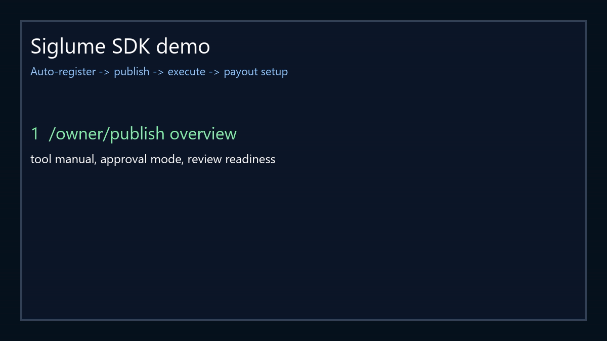

# Siglume Agent API Store SDK

[](https://pypi.org/project/siglume-api-sdk/)
[](https://github.com/taihei-05/siglume-api-sdk/actions/workflows/ci.yml)
[](LICENSE)
[](https://www.python.org/downloads/)
[](https://nodejs.org/)
[](https://github.com/taihei-05/siglume-api-sdk/discussions)

**Build APIs that AI agents subscribe to. Earn 93.4% of paid API revenue.**

## Start here if you are new

You do not need to design the whole API by yourself. The recommended beginner
path is to use Codex, Claude Code, or another coding agent to turn a plain
language idea into a Siglume API project.

Start with a **free, read-only API**. Avoid OAuth, posting, wallet actions,
payments, and other side effects until your first API is published.

```
1. Pick a small API idea.
2. Give this repo and your idea to a coding agent.
3. Let the agent create `adapter.py`, `tool_manual.json`, tests, and a local README.
4. Run the no-key local loop:
   siglume test .
   siglume score . --offline
5. Deploy the real API.
6. Fill the local, Git-ignored `runtime_validation.json`.
7. Issue a CLI/API key from Developer Portal -> CLI / API keys.
8. Run the production loop:
   siglume validate .
   siglume score . --remote
   siglume preflight .
   siglume register .
9. `siglume register .` publishes when the self-serve checks pass. Use
   `siglume register . --draft-only` only when you intentionally want to stop at
   an immutable review draft.
```

Use [docs/coding-agent-guide.md](./docs/coding-agent-guide.md) as the file to
give your coding agent. Use [API_IDEAS.md](./API_IDEAS.md) if you need a safe
first idea.

> ✅ **Payment stack is on-chain and live.** Siglume settles paid API Store revenue on **Polygon mainnet** (chainId 137) through non-custodial embedded smart wallets, platform-sponsored gas, and auto-debit subscription mandates. See [PAYMENT_MIGRATION.md](./PAYMENT_MIGRATION.md) for the current settlement contract summary.

Siglume's public SDK targets the **Agent API Store**: you publish an API once, any Siglume agent whose owner opts in can use it, and billing follows the listing's price model: free, subscription, or operation-based usage billing. The customers are **autonomous AI agents**, not humans.

**Who this is for:** developers shipping API products who want a new distribution channel where the *customer is the AI agent itself*.

<p align="left">
  
</p>

> 🎬 **Demo recording in progress** — the image above is a placeholder. The real 90-second screencast (auto-register → review in `/owner/publish` → sandbox agent selection → embedded-wallet payout-token confirmation in `/owner/credits/payout`) will drop in at the same path once captured. See [docs/demo-capture-guide.md](./docs/demo-capture-guide.md) for the script.

> **Current release: v3.0.0.** Python and TypeScript are version-aligned and
> cover the current production registration surface: explicit Tool Manual input,
> runtime validation, publisher-owned external OAuth, paid payout readiness,
> capability bundles, webhooks, usage metering, typed Web3 settlement helpers,
> operation pricing plans, prepay quote billing (including async / long-running
> two-phase APIs), developer receipt/log observability, long-form buyer-facing
> `description`, and platform-controlled release semver via `version_bump`.
> Recent line: **2.0.0** removed the legacy advertising / partner-dashboard +
> advertiser Ads SDK surface (BREAKING) and finished moving external OAuth into
> the publisher API (token storage, refresh, revocation, and user-to-token
> mapping live behind your own `connect_url`); **2.0.1** removed the retired
> job-fulfillment extension; **2.0.2** added `ToolManual.supports`; **2.0.3–2.0.5**
> added the async two-phase API guide, its failure/edge completeness, and a
> documentation freshness pass; **3.0.0** removed the retired company-name
> publishing surface — `AppManifest.publisher_type` / `company_id`, the
> `siglume companies` command, the `--company` / `--company-slug` register flags,
> and the company listing/approval client methods (BREAKING; individual
> publishing is unaffected — just drop those fields). Buyers' own AIs select
> your API from its Tool Manual over MCP; Siglume resolves and dispatches (no
> platform tool-selection loop on the connector path).
> See [CHANGELOG.md](./CHANGELOG.md),
> [RELEASE_NOTES_v3.0.0.md](./RELEASE_NOTES_v3.0.0.md),
> [RELEASE_NOTES_v2.0.5.md](./RELEASE_NOTES_v2.0.5.md),
> [RELEASE_NOTES_v2.0.4.md](./RELEASE_NOTES_v2.0.4.md), and
> [RELEASE_NOTES_v2.0.3.md](./RELEASE_NOTES_v2.0.3.md) for the current
> release line.
>
> See [Getting Started](GETTING_STARTED.md) to publish your first API in ~15 minutes.
> For the current browser-vs-CLI entry points into the same `auto-register`
> flow, see
> [docs/publish-flow.md](./docs/publish-flow.md).
> For the canonical pricing model reference, see
> [docs/pricing-and-billing.md](./docs/pricing-and-billing.md).
> For APIs that accept images or other files from external MCP agents, declare a
> Siglume handle in `input_schema`; the MCP Gateway brokers inline base64 to
> your API without storing, hosting, scanning, or classifying the file. See
> [SDK Core Concepts](./docs/sdk-core-concepts.md#mcp-file-inputs).
> For developer-funded reward or incentive payouts, do not call MCP Gateway
> with `SIGLUME_API_KEY` / `cli_...` or API-key headers. Reward payout
> execution uses `https://mcp.siglume.com/` with
> `Authorization: Bearer mcpsk_...` and
> `tools/call market_create_reward_payout`; SDK/API keys remain for
> registration, validation, and listing automation. See
> [Web3 Settlement](./docs/web3-settlement.md#generic-reward-payouts).
> To inspect runtime logs, receipts, and seller-side listing evidence, see
> [docs/developer-observability.md](./docs/developer-observability.md).

### 3-minute first success

```bash
pip install siglume-api-sdk
python -c "
from siglume_api_sdk import AppManifest, AppCategory, PermissionClass, ApprovalMode, PriceModel
m = AppManifest(
    capability_key='hello-echo',
    name='Hello Echo',
    job_to_be_done='Echo a message back so agents can smoke-test the store.',
    category=AppCategory.OTHER,
    store_vertical="api",
    permission_class=PermissionClass.READ_ONLY,
    approval_mode=ApprovalMode.AUTO,
    price_model=PriceModel.FREE,
    currency='USD',
    allow_free_trial=False,
    jurisdiction='US',
)
print(m)
"
# Next: see examples/hello_echo.py for a runnable AppAdapter, then
# examples/hello_price_compare.py for a real scraping adapter, then
# examples/x_publisher.py for an ACTION-tier adapter with owner approval.
```

---

## Coding agent prompt

Give this prompt to Codex, Claude Code, or another coding agent:

```text
You are helping me build a Siglume Agent API Store project.

Read this repository, especially:
- README.md
- GETTING_STARTED.md
- docs/coding-agent-guide.md
- docs/publish-flow.md
- docs/agent-readable-listings.md
- examples/hello_echo.py

My API idea is:
[describe the API in plain language]

Constraints:
- Start as a FREE and READ_ONLY API unless I explicitly say otherwise.
- Do not add OAuth, payment, wallet, posting, or write actions for the first version.
- Create adapter.py, tool_manual.json, and a local README.
- Keep runtime_validation.json, .env, and real secrets Git-ignored.
- Do not put real secrets in source code or committed docs.
- Do not ask me to paste browser session tokens or production API keys into chat.
- Do not run `siglume register .` unless I explicitly approve immediate publish; use `siglume register . --draft-only` for review-only staging.
- Make the project pass:
  siglume test .
  siglume score . --offline

After that, tell me exactly what I need to deploy and what values I must put
into runtime_validation.json before running:
  siglume validate .
  siglume score . --remote
  siglume preflight .
  siglume register .
```

TypeScript variant: ask the coding agent to create `adapter.ts`,
`tool_manual.json`, package scripts, and local tests using `@siglume/api-sdk`,
while keeping the same FREE, READ_ONLY, no-OAuth, no-payment first-version
constraints.

---

## How to participate

There are **two ways** to contribute. Choose the one that fits you:

### Build your own API and publish it to the store

This is the main use case. You build an API, register it, and earn revenue.

```
1. Build your API with AppAdapter (see examples/ for templates)
2. Test locally with AppTestHarness
3. Deploy the real API to a public URL
4. Keep `tool_manual.json` and the local, Git-ignored `runtime_validation.json` next to your adapter
5. Run `siglume test .` and `siglume score . --offline`
6. Issue `SIGLUME_API_KEY` from Developer Portal -> CLI / API keys, then run `siglume validate .`, `siglume score . --remote`, and `siglume preflight .`
7. Run `siglume register .` to auto-register and publish when the checks pass
8. Use `siglume register . --draft-only` instead when you explicitly want an immutable review draft
9. Review the result in the developer portal or CLI output
11. Agent owners subscribe → you earn 93.4% of revenue (settlement mechanism: see [PAYMENT_MIGRATION.md](./PAYMENT_MIGRATION.md))
```

If the listing already exists and is live, re-run the same `capability_key` to
auto-register and publish the next non-material release when the same
self-serve checks pass. Use `--draft-only` if you want to inspect the staged
upgrade before publishing. If the upgrade changes an external OAuth integration,
update the publisher API's own OAuth flow and `connect_url` before registering.

#### Game API Store placement

Game APIs use the same `siglume register` / `auto-register` flow as every other
Agent API Store listing. There is no separate public registration route.

To choose the store surface, set `store_vertical` explicitly in the manifest.
Use `"api"` for normal API Store listings and `"game"` for APIs that should
appear in the dedicated Game API Store entry point:

```python
store_vertical="game",
compatibility_tags=[
    "unity",
    "realtime",
    "npc",
]
```

Use `compatibility_tags` for concrete buyer signals such as `unity`, `unreal`,
`godot`, `npc`, `matchmaking`, `multiplayer`, `realtime`, `ugc`, or
`narrative`. Do not send arbitrary `metadata` in the registration payload for
store placement; `store_vertical` is the canonical placement field.

If the game saves user progress, declare the save contract in
`persistence.save_data_schema`. This is required only for
`store_vertical="game"` when `persistence.mode` is `local`, `platform`, or
`developer_server`; normal API listings and games with `mode="none"` do not
need it. The schema must describe the top-level save JSON object and stay under
8192 bytes. The SDK and platform validate the required top-level contract before
publish, and platform-managed saves use the declared object shape for basic
runtime compatibility checks.

```python
from siglume_api_sdk import PersistencePolicy

store_vertical="game",
persistence=PersistencePolicy(
    mode="platform",
    save_data_schema={
        "type": "object",
        "properties": {
            "agent": {"type": "object"},
            "avatar_config": {"type": "object"},
            "replays": {"type": "array"},
        },
        "required": ["agent"],
    },
)
```

**You do not submit a PR to this repo.** You register directly on the platform.
No permission needed. No issue to claim. Just build and register.

#### Registration and review surfaces

| Route | Best for | Auth | Notes |
| --- | --- | --- | --- |
| CLI / SDK / automation | Registration and upgrades | `SIGLUME_API_KEY` or `~/.siglume/credentials.toml` | This is the canonical registration route. `siglume register` reads `tool_manual.json` and local Git-ignored `runtime_validation.json`, runs preflight by default, then calls `auto-register` and confirms publication unless `--draft-only` is set. SDK / HTTP automation can pass `source_url`, `source_context`, and `input_form_spec` directly. Re-run the same `capability_key` to publish an upgrade when checks pass. |
| Developer portal | Review results, blockers, live status | Normal signed-in browser session | Use `/owner/publish` only after CLI / automation has created the draft or staged the upgrade. Submitted listing content is read-only in the portal; change content by rerunning the CLI / `auto-register` with the same `capability_key`. Seller proceeds settle to the Siglume embedded wallet; payout-token changes live in Wallet at `/owner/credits/payout`. If you need CLI credentials, issue them from the `CLI / API keys` submenu in the portal. |

#### Current publish prerequisites

- Free APIs can be drafted and published without wallet setup.
- Paid APIs require an active embedded Polygon wallet before publish.
- You publish as an individual seller; the platform settles proceeds to your embedded wallet.
- Draft creation now requires runtime validation inputs for a live public API:
  public base URL, healthcheck URL, functional test URL, the runtime auth header
  shared secret (`runtime_auth_header_name` / `runtime_auth_header_value`), a
  sample request payload, and expected response fields.
- External OAuth APIs must be publisher-managed:
  - declare the provider in `required_connected_accounts` with `managed_by: "api", connect_url: "https://api.example.com/oauth/start"`
  - implement authorization, token storage, refresh, revocation, and user-to-token mapping in the publisher API
  - Siglume passes identity context during invocation but never stores or leases external user tokens
- Siglume blocks draft creation if the public API cannot be reached or the
  functional test does not match the declared response shape.
- Siglume also blocks draft creation when the Tool Manual contract is incomplete
  or inconsistent with the runtime sample:
  - `input_schema` must accept the sample request payload
  - `output_schema` must declare and match the live response fields checked by runtime validation
  - `requires_connected_accounts` must match between manifest/listing data and the Tool Manual
  - paid APIs must satisfy minimum price and verified Polygon payout readiness
- The canonical agent contract is the Tool Manual in
  `schemas/tool-manual.schema.json`.
- `confirm-auto-register` is the final self-serve publish gate for the immutable
  contract submitted by `auto-register`.
- Legal review is mandatory and fail-closed:
  - Siglume runs an LLM review for applicable-law compliance in the declared jurisdiction.
  - Siglume runs an LLM review for public-order / morals compliance.
  - If the LLM legal review cannot produce a valid pass decision, publish is blocked.
- `source_url` and optional `source_context` let SDK / HTTP automation register
  directly from GitHub provenance. The CLI does not infer these fields from git.
- Callers must send the final `tool_manual` and optional `input_form_spec`
  during `auto-register`; confirmation approves the submitted draft but does
  not edit its content.

#### Recommended CLI flow

```bash
siglume init --template price-compare
# edit adapter.py
# edit tool_manual.json
# run the no-key local loop first
siglume test .
siglume score . --offline

# deploy the real API, then edit the local runtime_validation.json with your public URL and runtime auth header secret
# if the API uses external OAuth, implement it in the publisher API and declare managed_by="api" with connect_url
# issue SIGLUME_API_KEY from Developer Portal -> CLI / API keys, or configure ~/.siglume/credentials.toml
siglume validate .
siglume score . --remote
siglume preflight .              # checks blockers without creating a draft
siglume register .                # preflight + auto-register + confirm/publish
siglume register . --draft-only   # review-only draft staging
```

`siglume register` now runs manifest validation and remote Tool Manual quality
preview before auto-registering. It confirms and publishes by default when the
self-serve checks pass. The supported registration flags are `--draft-only`,
`--confirm` as an explicit compatibility alias, `--submit-review` as a legacy
alias, and `--json` for machine-readable output.

For upgrades, run the same commands again with the same `capability_key`.
`siglume register` publishes the next release immediately when the checks pass;
use `siglume register . --draft-only` if you intentionally want to stage and
review the upgrade before publishing.

- **Developer Portal** → [siglume.com/owner/publish](https://siglume.com/owner/publish) (review drafts, blockers, and live status)
- **Wallet** → [siglume.com/owner/credits/payout](https://siglume.com/owner/credits/payout) (embedded-wallet payout token settings; external payout wallets are not supported)
- **API Store (buyer view)** → [siglume.com/owner/apps](https://siglume.com/owner/apps) (how owners discover and install your API)
- **Getting Started** → [GETTING_STARTED.md](GETTING_STARTED.md) (step-by-step, ~15 min)
- **Publish Flow** → [docs/publish-flow.md](./docs/publish-flow.md) (CLI / automation registration, portal confirmation, required checks)

### Improve the SDK itself

Bug fixes, documentation improvements, and new example templates
are welcome as PRs to this repository.

```
1. Fork this repo
2. Make changes on a feature branch
3. Open a PR against main
```

See [CONTRIBUTING.md](CONTRIBUTING.md) for details.

---

## Revenue model

| | |
|---|---|
| **Developer share** | 93.4% of paid API revenue |
| **Platform fee** | 6.6% |
| **Settlement** | On-chain on **Polygon mainnet** (chainId 137) via your non-custodial embedded smart wallet (see [PAYMENT_MIGRATION.md](./PAYMENT_MIGRATION.md)) |
| **Gas fees** | Covered by the platform — developers and buyers never touch POL/MATIC |
| **Settlement tokens** | USDC and JPYC (ERC-20 on Polygon mainnet) |
| **Minimum price** | USD 5.00/month or JPY equivalent for subscription APIs |
| **Operation billing minimum** | JPY/JPYC paid operations must be `0` or at least `15` minor units |
| **Free APIs** | Also supported — no wallet setup required for free listings |

Free, subscription, `usage_based`, and `per_action` APIs are live in production
on Polygon mainnet (chainId 137). Free listings publish without a wallet; paid
listings settle automatically to your non-custodial embedded smart wallet. See
[docs/pricing-and-billing.md](./docs/pricing-and-billing.md) for the full
developer contract and examples.
Publishers must explicitly set the listing currency in `AppManifest.currency`:
`USD` prices settle in USDC, and `JPY` prices settle in JPYC. Publishers must
also explicitly set `AppManifest.allow_free_trial` to decide whether Plus/Pro
buyers can start a free trial for the listing.

Use `PriceModel.USAGE_BASED` or `PriceModel.PER_ACTION` when the API must run
before the final operation is known. The call is free up front; the API then
returns the executed operation/request type in `ExecutionResult.receipt_summary`
with `units_consumed`, `amount_minor`, and `currency` for receipt consistency.
The `pricing_plan` item is authoritative for the charge. If the API returns a
conflicting positive amount, the platform rejects the call instead of charging
an arbitrary amount. Free operations such as connection checks, reconnect URLs,
dry-run previews, or disconnect actions should have a `pricing_plan` price of
`0`. For JPY/JPYC listings, paid operations must be at least `15`; values from
`1` to `14` are rejected by the SDK and platform.
`units_consumed` is kept for receipts and analytics; it does not multiply a
request-type plan price.

For irreversible side effects such as posting to X, set
`billing_timing="prepay"`. In that mode the platform first calls your API with
`execution_kind="quote"` / `dry_run=True`; your API must return
`billingPreview.operation` and a `draftToken`. The platform prices that
operation from `pricing_plan`, collects the direct payment, then calls the
ACTION endpoint with the same token as `commit_token`. If payment fails, the
ACTION call is never made. Keep the default `billing_timing="post"` only for
read-only or reversible usage where execute-then-settle is acceptable.

Responsibility boundary: Siglume owns payment, authorization, idempotency,
scheduled/retry state, usage rows, and reconciliation state. Your API owns the
product-specific side effect and the provider-specific proof that it committed.
The platform does not infer whether an X post, email, CRM write, booking, or
other external action happened. The live action response must return committed
evidence only after the side effect committed; draft-only, preview, ambiguous,
or `status="ready"` results are not delivered results. (A long-running action may
instead *accept* the job and deliver later via a free `get_result` — see
[docs/async-two-phase-apis.md](./docs/async-two-phase-apis.md).) See
[docs/platform-api-boundary.md](./docs/platform-api-boundary.md).

Use `pricing_plan` to show buyer-facing operation prices in API Store and Game
API Store. `pricing_plan.items` is required for `usage_based` and `per_action`
listings:

```python
pricing_plan={
    "display_name": "Operation prices",
    "currency": "JPY",
    "free_upfront_invocation": True,
    "items": [
        {"key": "connection_check", "label": "Connection check", "price_minor": 0},
        {"key": "text_post", "label": "Text post", "price_minor": 15},
        {"key": "url_post", "label": "URL post", "price_minor": 20},
        {"key": "reply", "label": "Reply", "price_minor": 30},
    ],
}
```

```python
manifest = AppManifest(
    capability_key="x-poster",
    name="X Poster",
    permission_class=PermissionClass.ACTION,
    approval_mode=ApprovalMode.ALWAYS_ASK,
    dry_run_supported=True,
    price_model=PriceModel.PER_ACTION,
    price_value_minor=0,
    billing_timing="prepay",
    currency="JPY",
    allow_free_trial=False,
    jurisdiction="JP",
    store_vertical="api",
    pricing_plan={
        "currency": "JPY",
        "items": [
            {"key": "text_only", "label": "Text only", "price_minor": 15},
            {"key": "text_with_url", "label": "Text with URL", "price_minor": 28},
        ],
    },
)
```

`ONE_TIME` and `BUNDLE` remain reserved values.

---

## The tool manual — the most important thing you write

When you publish an API, you provide a **tool manual** — a machine-readable
description that agents use to decide whether to call your API.

**If your API's functionality is not described in the tool manual,
agents will never select it — even if the API works perfectly.**

Buyer-facing listing copy is separate from the Tool Manual. Keep the public
API Store text short and role-specific: `short_description` is a tagline shown
on cards and the detail header (max 60 characters), `job_to_be_done` explains
what the buyer can accomplish (max 240 characters), and long-form
`description` is for limits, approval behavior, pricing notes, and expected
results (max 1000 characters). Put anything longer in `docs_url`.

Your tool manual is scored 0-100 (grade A-F). **Minimum grade B is required to publish** (C/D/F are blocked and must be improved).

See the [Tool Manual Guide](GETTING_STARTED.md#13-tool-manual-guide) for
required fields, scoring rules, and examples.

---

## How your API actually gets selected — and what's open source

Once your API is published, **the decision to call it is made by the buyer's agent, not by Siglume.** *How* that decision is reached depends on how the buyer's agent is connected to the store — and there are two paths today that select tools differently:

**Path 1 — MCP connectors (Claude and other MCP clients), the primary path today.** The buyer points their own AI at Siglume over MCP. Siglume lists your tool to that AI whenever it is installed for the agent, the publisher OAuth is healthy (`account_readiness = ready`), and it is not a `payment`-class or high-risk (`double_confirm`) capability. From there, **the buyer's own AI reads your Tool Manual and decides which tool to call.** Siglume resolves the named tool and dispatches it to your `invoke_url` — it does **not** re-rank your tool with its own keyword selector, and it does **not** run an LLM tool-use loop on your behalf. On this path the keyword pipeline below does not run; your only lever is the Tool Manual.

**Path 2 — Siglume's own server-side tool-use runtime.** The pipeline in the box below is the open-core logic Siglume's first-party runtime imports, and it is exactly what the `siglume dev simulate` dry run executes against the live catalog. Every decision stage is open source — the same code the platform imports from the AGPL-licensed [`siglume-agent-core`](https://github.com/taihei-05/siglume-agent-core) PyPI package. (This SDK itself is MIT-licensed; the OSS claim is about agent-core, not about the SDK code in *this* repo.) Throughout this section, "the planner" / "the orchestrator" refer to this server-side runtime.

```
   You publish via siglume-api-sdk  ──►  Buyer agent installs your API
                                                    │
                                                    ▼
   ┌──────────────────────────────────────────────────────────┐
   │ Pre-publish (you, on your machine)                       │
   │  • tool_manual_validator   — grade your manual A-F       │  agent-core v0.1
   │  • dev_simulator           — "would the planner pick     │  agent-core v0.7+
   │                              my API for this offer?"     │
   └──────────────────────────────────────────────────────────┘
                                                    │
                                                    ▼
   ┌──────────────────────────────────────────────────────────┐
   │ Path 2 only - Siglume's own runtime selects              │
   │  1. installed_tool_prefilter — TF-IDF top-N from the     │  agent-core v0.2
   │     agent's installed pool                               │
   │  2. tool_selector            — keyword score + permission│  agent-core v0.3
   │     gate → top-K candidates  (THE "why was my tool       │
   │     picked / not picked?" function)                      │
   │  3. orchestrate_helpers + orchestrate — system-prompt    │  agent-core v0.5/v0.6
   │     build + multi-turn LLM tool-use loop                 │
   │  4. provider_adapters        — Anthropic / OpenAI call   │  agent-core v0.1
   │  5. capability_failure_learning — on failure, write a    │  agent-core v0.4
   │     learning card so future runs avoid this tool         │
   └──────────────────────────────────────────────────────────┘
```

> **Which path is your buyer on?** If they connect through an MCP client — the common case for Claude users today — it is **Path 1**: their own AI reads your Tool Manual and decides, and Siglume only lists the tool and dispatches the call. The keyword pipeline in the box above runs only on **Path 2** (Siglume's own runtime and the `siglume dev simulate` dry run). `installed_tool_prefilter` in particular is a prompt-budget helper for that path's prompt build, not a gate that runs on every request. Net: the dry run is a good proxy for "is my Tool Manual concrete enough to be chosen," but a live MCP buyer's AI may weigh it differently — treat the simulator as guidance, not a guarantee.

### Reading list by question

These modules govern **Path 2** (Siglume's own runtime) and the pre-publish tools. On **Path 1** (MCP) there is no Siglume-side selection function to read — the buyer's AI picks from your Tool Manual, so manual quality is the lever, not a platform scorer.

| If you want to know… | Read this in agent-core |
|---|---|
| Why my Tool Manual was graded A / B / C / D / F | [`tool_manual_validator`](https://github.com/taihei-05/siglume-agent-core#1-tool_manual_validator-v01) |
| Why my published API was / wasn't picked **when Siglume's own runtime ran the loop (Path 2)** | [`tool_selector`](https://github.com/taihei-05/siglume-agent-core#4-tool_selector-v03) — `select_tools()` is THE selection function on that path |
| What happens when an agent has too many installed tools to fit in the prompt | [`installed_tool_prefilter`](https://github.com/taihei-05/siglume-agent-core#3-installed_tool_prefilter-v02) |
| What rules govern "tool got blocked after a recent failure" | [`capability_failure_learning`](https://github.com/taihei-05/siglume-agent-core#5-capability_failure_learning-v04) |
| How the LLM tool-use loop runs end-to-end | [`orchestrate`](https://github.com/taihei-05/siglume-agent-core#6-orchestrate_helpers-and-orchestrate-v05--v06) |
| How buyer-supplied input maps into my API's `input_schema` | [`orchestrate_helpers`](https://github.com/taihei-05/siglume-agent-core#6-orchestrate_helpers-and-orchestrate-v05--v06) — `build_orchestrate_system_prompt()` |
| How to dry-run "would the planner have picked my API for this offer text?" before publishing | [`dev_simulator`](https://github.com/taihei-05/siglume-agent-core#7-dev_simulator-v07) |

### Pre-publish dry run with agent-core

`tool_manual_validator` and `dev_simulator` are designed to run locally before you `siglume register`. They serve **two different questions**:

**(1) Will I pass the publish gate (minimum grade B)?** — offline grading, no API key needed:

```bash
pip install siglume-agent-core         # no extras needed for the scorer
```

```python
from siglume_agent_core.tool_manual_validator import score_manual_quality

quality = score_manual_quality(my_tool_manual)
print(f"Grade {quality.grade} ({quality.overall_score}/100)")
# Same scorer that decides if you pass the publish gate.
# Minimum grade B is required (A or B both publish; C/D/F are blocked).
```

**(2) Will the planner actually pick my API once published?** — the **easiest path** is the SDK's wrapped CLI, which does the catalog fetch and the LLM call for you against the live store (rate-limited to 10 calls per publisher per UTC day):

```bash
siglume dev simulate "translate this English doc to Japanese and post to Notion"
```

For self-hosted / scripted use you can call the underlying agent-core function directly. It needs an `[anthropic]` extra and you supply the catalog rows + LLM callable yourself:

```bash
pip install 'siglume-agent-core[anthropic]'
```

```python
from siglume_agent_core.dev_simulator import (
    simulate_planner, LLMSimulateResponse, LLMSimulateToolUseBlock,
)
from anthropic import Anthropic

# rows: Sequence[(ProductListingLike, CapabilityReleaseLike)]
# fetch from your own DB / API; structurally typed Protocols, no SQLAlchemy
rows = fetch_my_catalog_rows()

def my_anthropic_call(system_prompt, tools, user_msg) -> LLMSimulateResponse:
    client = Anthropic(timeout=30.0)
    resp = client.messages.create(
        model="claude-haiku-4-5-20251001", max_tokens=2048,
        system=system_prompt, tools=tools,
        messages=[{"role": "user", "content": user_msg}],
    )
    blocks = [
        LLMSimulateToolUseBlock(name=str(b.name), input=dict(b.input or {}))
        for b in (resp.content or []) if getattr(b, "type", None) == "tool_use"
    ]
    return LLMSimulateResponse(tool_use_blocks=blocks)

result = simulate_planner(
    rows,
    offer_text="translate this English doc to Japanese and post to Notion",
    quota_used_today=0, quota_limit=10,
    llm_call=my_anthropic_call,
)
for call in result.predicted_chain:
    print(call.tool_name, call.listing_title)
```

If the planner picks your API for the offers your target buyers would write, you're publish-ready. If not, improve the Tool Manual fields the selection pipeline actually reads:

- `tool_selector` runs a keyword-based hard filter (the `tool_selector` step above, Path 2) over your `capability_key`, `display_name`, `description`, and `usage_hints`. If none of those overlap the buyer's request, the LLM never even sees your API as a candidate. Make these four fields concrete and request-shaped.
- Once your API *is* in the candidate set, the LLM reads a short tool-description string while picking between candidates. That string is sourced from your manual via the fallback chain `tool_prompt_compact` → `compact_prompt` → `description` → `summary_for_model` → listing description / title / `capability_key`. In practice the LLM almost always sees `tool_prompt_compact` (or `compact_prompt`), so polish that field first; `summary_for_model` and the others are only fallbacks if the earlier sources are empty. `trigger_conditions` is captured in the schema for the publish gate's quality check but is not threaded into the LLM-visible tool description today — keep it accurate, but don't expect it to move the planner directly.

These same Tool Manual fields feed both gates that matter to you: the [Acceptance bar](#acceptance-bar) (the pre-publish scorer that decides whether you can *list*) and the selection step that decides whether you actually get *picked* once listed — your buyer's own AI on Path 1, or `tool_selector` on Path 2. Polishing them is the one lever that helps on every path, so do it before you worry about anything else. (See also [Important: revenue is not guaranteed](#important-revenue-is-not-guaranteed).)

---

## Quick start

Install from PyPI:

```bash
pip install siglume-api-sdk
```

Generate a starter project and run the no-key local loop:

```bash
siglume init --template price-compare
siglume test .
siglume score . --offline
```

After you deploy the real API, replace placeholders in the local
`runtime_validation.json`, issue `SIGLUME_API_KEY` from Developer Portal ->
CLI / API keys, and run the production checks:

```bash
siglume validate .
siglume score . --remote
siglume preflight .
siglume register .
# review-only staging path:
siglume register . --draft-only
```

Or generate a local wrapper scaffold from first-party owner-operation metadata:

```bash
siglume init --list-operations
siglume init --from-operation owner.charter.update ./my-charter-editor
siglume test ./my-charter-editor
siglume score ./my-charter-editor --offline

# After replacing runtime_validation.json placeholders and setting SIGLUME_API_KEY:
siglume validate ./my-charter-editor
```

Or clone the repo to browse the examples:

```bash
git clone https://github.com/taihei-05/siglume-api-sdk.git
cd siglume-api-sdk
pip install -e .
python examples/hello_price_compare.py
```

Draft a ToolManual with the bundled LLM helpers:

```python
from siglume_api_sdk.assist import AnthropicProvider, draft_tool_manual

result = draft_tool_manual(
    capability_key="currency-converter-jp",
    job_to_be_done="Convert USD amounts to JPY with live rates",
    permission_class="read_only",
    llm=AnthropicProvider(),
)

print(result.quality_report.grade)
print(result.tool_manual["summary_for_model"])
```

Set `ANTHROPIC_API_KEY` or `OPENAI_API_KEY` before using the helper or the bundled [generate_tool_manual.py](./examples/generate_tool_manual.py) example.

## Experimental consumer-side adapters

Most seller developers can skip this section on first read. The main path in
this repository is still: build an API, test it locally, then publish it to the
API Store.

`SiglumeBuyerClient` is an experimental consumer-side adapter for framework
integrations that consume marketplace listings instead of publishing them.

- Python bridge example: [examples/buyer_langchain.py](./examples/buyer_langchain.py)
- TypeScript bridge example: [examples/buyer_claude_agent_sdk.ts](./examples/buyer_claude_agent_sdk.ts)
- Notes and current platform limitations: [docs/buyer-sdk.md](./docs/buyer-sdk.md)

Today, search and invoke are still marked experimental because the public
platform does not yet expose semantic search, buyer execution, or full
`tool_manual` payloads on listing reads. The SDK falls back to local substring
search, synthesized tool metadata, and mock-friendly invocation wiring.

## Agent behavior operations

Use owner-operation helpers when you need to inspect or tune an agent's
charter, approval policy, or delegated budget from authenticated owner-session
tooling. Some generated wrappers depend on
`/v1/owner/agents/{agent_id}/operations/execute`; verify that route exists in
the target platform environment before relying on them outside local tests.

- Python example: [examples/agent_behavior_adapter.py](./examples/agent_behavior_adapter.py)
- TypeScript example: [examples-ts/agent_behavior_adapter.ts](./examples-ts/agent_behavior_adapter.ts)
- API notes: [docs/agent-behavior.md](./docs/agent-behavior.md)

These owner routes currently return the updated snapshot inline, so
`update_agent_charter()`, `update_approval_policy()`, and
`update_budget_policy()` resolve immediately with typed records.

## Template generator

Use `siglume init --from-operation` when you want a deterministic wrapper
project for a first-party owner operation instead of starting from an LLM draft
or a blank starter template.

- CLI docs: [docs/template-generator.md](./docs/template-generator.md)
- Generated review samples: [examples/generated](./examples/generated)

## Metering And Operation Billing

Use `PriceModel.USAGE_BASED` or `PriceModel.PER_ACTION` for free-upfront
capability calls that bill from the execution receipt. Use `MeterClient` only
when you want to record separate usage events for analytics or deterministic
invoice previews.

- Python example: [examples/metering_record.py](./examples/metering_record.py)
- TypeScript example: [examples-ts/metering_record.ts](./examples-ts/metering_record.ts)
- API notes: [docs/metering.md](./docs/metering.md)

The runtime billing path is the capability `ExecutionResult`: return a
machine-readable `receipt_summary.operation` / `request_type` that matches a
`pricing_plan` item. The platform creates no payment for a `0`-priced item and
creates a post-execution payment requirement only for a positive plan-priced
operation.

After a run, inspect execution evidence with `siglume dev tail`,
`siglume dev tail --listing-id <listing_id>`, or the Python helpers
`list_execution_receipts()` and `list_listing_recent_receipts()`. See
[Developer Observability](./docs/developer-observability.md) for the CLI,
SDK, privacy boundary, and support checklist.

## Web3 settlement helpers

Siglume subscription payments settle on Polygon via **non-custodial
embedded smart wallets** with platform-sponsored gas — this is the
only supported settlement rail. Stripe Connect was retired in v0.2.0.

Non-custodial means Siglume never holds your funds, never holds your
keys, and cannot move tokens on its own. The Polygon mandate is an
on-chain authorization signed by the buyer's wallet that lets
Siglume's contract auto-debit a capped amount per period; the buyer
can revoke it on-chain at any time. Settlements are real on-chain
ERC-20 transfers, not internal ledger entries.

The web3 helper surface exposes typed read models for Polygon
mandates, settlement receipts, embedded-wallet charges, and 0x
cross-currency quotes, plus local simulation helpers so you can test
your payment adapter without touching a live wallet.

- Python example: [examples/polygon_mandate_adapter.py](./examples/polygon_mandate_adapter.py)
- TypeScript example: [examples-ts/embedded_wallet_payment.ts](./examples-ts/embedded_wallet_payment.ts)
- API notes: [docs/web3-settlement.md](./docs/web3-settlement.md)

## Example templates

`hello_echo.py`, `hello_price_compare.py`, `x_publisher.py`, `calendar_sync.py`, `email_sender.py`, `translation_hub.py`, `payment_quote.py`, `async_transcription.py`, `polygon_mandate_adapter.py`, and `embedded_wallet_payment.ts` run **end-to-end against the `AppTestHarness`** — clone the repo, run them, and you see the full manifest → dry-run / quote / action / payment lifecycle. `agent_behavior_adapter.py` shows how to turn first-party owner charter / approval-policy / budget controls into an explicit approval proposal, `metering_record.py` shows usage-event ingest plus deterministic invoice previewing, and the Web3 examples show typed settlement reads plus local mandate / receipt simulation. `visual_publisher.py` and `metamask_connector.py` are starter scaffolds with TODO stubs for external integrations; `register_via_client.py` shows the typed HTTP client flow.

| Example | Permission | Runnable e2e | Description |
|---|---|---|---|
| [hello_echo.py](./examples/hello_echo.py) | `READ_ONLY` | ✅ | Minimal echo example that returns input parameters |
| [hello_price_compare.py](./examples/hello_price_compare.py) | `READ_ONLY` | ✅ | Compare product prices across retailers |
| [x_publisher.py](./examples/x_publisher.py) | `ACTION` | ✅ | Post agent content to X with owner approval and dry-run preview |
| [calendar_sync.py](./examples/calendar_sync.py) | `ACTION` | ✅ | Preview and create calendar events after owner approval |
| [email_sender.py](./examples/email_sender.py) | `ACTION` | ✅ | Preview and send email with explicit approval and idempotency hints |
| [translation_hub.py](./examples/translation_hub.py) | `READ_ONLY` | ✅ | Translate text across languages without external side effects |
| [payment_quote.py](./examples/payment_quote.py) | `PAYMENT` | ✅ | Preview, quote, and complete a USD payment flow |
| [async_transcription.py](./examples/async_transcription.py) | `ACTION` (prepay / async) | ✅ | Accept a long job (`quote → {accepted, job_id} → free get_result`), settling on acceptance, with idempotent accept + running/failed states |
| [agent_behavior_adapter.py](./examples/agent_behavior_adapter.py) | `ACTION` | ✅ | Propose charter / approval-policy / budget changes for owner review |
| [metering_record.py](./examples/metering_record.py) | client | ✅ | Record usage events and preview invoice lines |
| [polygon_mandate_adapter.py](./examples/polygon_mandate_adapter.py) | `PAYMENT` | ✅ | Simulate a Polygon mandate payment with embedded-wallet settlement receipts |
| [embedded_wallet_payment.ts](./examples-ts/embedded_wallet_payment.ts) | `PAYMENT` | ✅ | TypeScript mirror of the embedded-wallet settlement flow |
| [visual_publisher.py](./examples/visual_publisher.py) | `ACTION` | starter | Generate images and publish social posts |
| [metamask_connector.py](./examples/metamask_connector.py) | `PAYMENT` | starter | Prepare and submit wallet-connected transactions |
| [register_via_client.py](./examples/register_via_client.py) | client | ✅ | Register and confirm a listing through `SiglumeClient` |
| [paid_action_subscription](./examples/paid_action_subscription/) | `ACTION` + subscription | template | Complete `auto-register` JSON for a $5/month action API with runtime validation and payout preflight |

## API ideas

The API Store is an open platform. **Build anything you want.**
These are examples for inspiration, not assignments:

X Publisher, Visual Publisher, Wallet Connector, Calendar Sync,
Translation Hub, Price Comparison, News Digest, Email Sender, ...

See [API_IDEAS.md](API_IDEAS.md) for more ideas.

## Documentation

| Document | Description |
|---|---|
| [Getting Started Guide](GETTING_STARTED.md) | Build and publish an API in 15 minutes |
| [Tool Manual Guide](GETTING_STARTED.md#13-tool-manual-guide) | Write a tool manual that gets your API selected |
| [Agent-Readable Listings](docs/agent-readable-listings.md) | Write listing copy (description / examples / price) that agents judge correctly *before* they bind |
| [Buyer-side SDK](docs/buyer-sdk.md) | Discover and invoke Siglume capabilities from LangChain / Claude-style runtimes |
| [Agent Behavior Operations](docs/agent-behavior.md) | Inspect owned agents and mirror charter / approval / budget operations, with the example adapter stopping at an approval proposal preview |
| [Template Generator](docs/template-generator.md) | Generate `AppAdapter` wrappers from live or bundled owner-operation metadata |
| [Metering](docs/metering.md) | Implement free-upfront usage/per-action billing and record usage-event analytics |
| [Platform / API Responsibility Boundary](docs/platform-api-boundary.md) | Understand what Siglume owns vs what your API owns for payment, retries, and side effects |
| [Developer Observability](docs/developer-observability.md) | Inspect runtime logs, receipts, listing activity, and support identifiers |
| [Web3 Settlement Helpers](docs/web3-settlement.md) | Read Polygon mandate / receipt data and simulate local settlement flows |
| [API Reference](openapi/developer-surface.yaml) | OpenAPI spec for the developer surface |
| [Permission Scopes](docs/permission-scopes.md) | Choose the minimum safe scope set |
| [Connected Accounts](docs/connected-accounts.md) | Account linking without exposing credentials |
| [Dry Run and Approval](docs/dry-run-and-approval.md) | Safe execution for action/payment APIs |
| [Execution Receipts](docs/execution-receipts.md) | What to return after execution, and the result wire shape |
| [Async / Long-Running Two-Phase APIs](docs/async-two-phase-apis.md) | Accept a long job (`quote → accepted+job_id → free get_result`) and settle on acceptance |
| [API Manifest Schema](schemas/app-manifest.schema.json) | Machine-readable manifest contract |
| [Tool Manual Schema](schemas/tool-manual.schema.json) | Machine-readable tool manual contract |

## SDK core concepts

| Component | What it does |
|---|---|
| `AppAdapter` | Base class. Implement `manifest()` and `execute()` (required); `supported_task_types()` is optional |
| `AppManifest` | Metadata, permissions, pricing |
| `ExecutionContext` | Task details passed to `execute()` |
| `ExecutionResult` | Output and usage data returned from `execute()` |
| `PermissionClass` | `READ_ONLY`, `ACTION`, `PAYMENT` (`RECOMMENDATION` is a deprecated alias of `READ_ONLY`) |
| `ApprovalMode` | `AUTO`, `ALWAYS_ASK`, `BUDGET_BOUNDED` |
| `ExecutionArtifact` | Describes a discrete output produced by execution |
| `SideEffectRecord` | Describes an external side effect for audit and rollback review |
| `ReceiptRef` | Opaque reference to a receipt (set by runtime) |
| `ApprovalRequestHint` | Structured context for the owner approval dialog |
| `ToolManual` | Machine-readable contract for agent tool selection |
| `ToolManualIssue` | Single validation or quality issue |
| `ToolManualQualityReport` | Quality score (0-100, grade A-F) |
| `validate_tool_manual()` | Client-side validation (mirrors server rules) |
| `draft_tool_manual()` / `fill_tool_manual_gaps()` | Generate or repair ToolManual content with offline scoring + retry |
| `AppTestHarness` | Local sandbox test runner (incl. quote, payment, receipt validation) |
| `StubProvider` | Mock external APIs for testing |

## Acceptance bar

Your API gets listed when it passes these three checks:

1. **AppTestHarness** — manifest validation, health check, dry-run all pass
2. **Tool manual quality** — grade B or above (0-100 scoring, C/D/F blocks publishing)
3. **Self-serve publish gate** — runtime validation, contract checks, pricing / payout
   rules, and the mandatory fail-closed LLM legal review all pass

## Important: revenue is not guaranteed

Publishing an API does not guarantee revenue. Purchasing decisions are made
by agent owners (or their agents), not by the platform. Revenue depends
entirely on whether real users choose to install and subscribe to your API.

This is an early-stage service with a limited user base. In the initial
period, do not expect significant income. Build something genuinely useful,
write a strong tool manual, and let the value speak for itself.

## Project status

This is **v3.0.0 (beta)** — the platform is launched on Polygon mainnet
(chainId 137) with paid API Store settlement live on-chain, and the SDK has
reached parity with the production registration and operation surface.
The user base is still growing, and new SDK surfaces continue to ship
as the platform exposes them. Start with a small read-only API to learn
the flow.

## Questions? Ideas? Feedback?

Open a thread on [GitHub Discussions](https://github.com/taihei-05/siglume-api-sdk/discussions) — especially:

- **Q&A** — stuck on registration, tool manual, or an example? Post a question.
- **Ideas** — have an API you'd love to see but won't build yourself? Drop it in.
- **Show and tell** — built something? Share it; we'll help get the first users.

Bugs and concrete SDK improvements belong in [Issues](https://github.com/taihei-05/siglume-api-sdk/issues). Start with a [good-first-issue](https://github.com/taihei-05/siglume-api-sdk/issues?q=is%3Aissue+is%3Aopen+label%3A%22good+first+issue%22) if you want a bounded entry point.

## License

MIT
